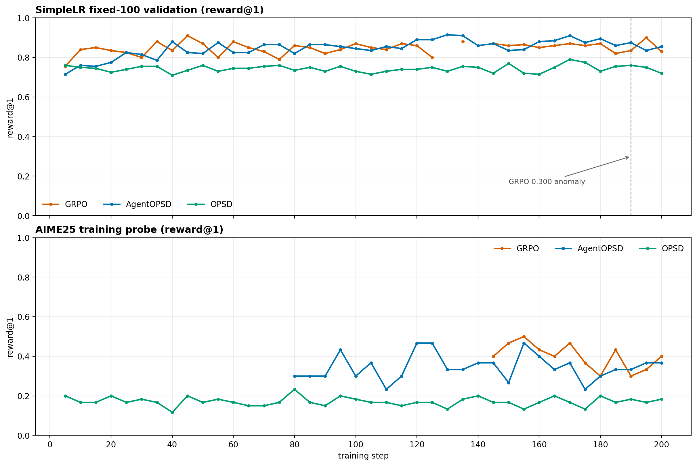

# GRPO/AgentOPSD/OPSD实验数据报告

本文汇总 GRPO、AgentOPSD 与 OPSD 的训练中指标、最终评测和 AgentOPSD checkpoint 评测。除特别注明外，比例均为 answer accuracy.

## 一、实验内容、模型与参数

实验比较三种训练信号对 Qwen3.5-4B 数学工具推理的影响。训练集为 `simplelr_math_35/train.parquet`：8,523 道单轮数学题，提供标准最终答案与元数据，不提供教师解题轨迹或工具调用轨迹；模型通过在线 rollout 和结果奖励学习。

| 项目 | 设置 |
|---|---|
| 基座模型 | Qwen3.5-4B，`enable_thinking=false` |
| 训练规模 | 200 steps；每步 16 prompts × 8 rollouts；学习率 1e-6 |
| 训练环境 | 最多 5 轮 Python 工具；每轮最大响应 2,048 tokens；上下文 18,432；沙箱超时 5 秒 |
| 训练/验证解码 | rollout temperature=1；训练内验证 temperature=0；thinking 关闭 |
| 最终独立评测 | 合并 HF 权重 + vLLM evaluator；TIR、5 轮、每轮 3,072 tokens、context 16,384、temperature=0 |
| 奖励 | `\boxed{}` 最终答案匹配；正确但无实质工具使用按 SimpleTIR 规则记半分 |

| 算法 | 训练信号 |
|---|---|
| GRPO | 任务结果奖励驱动的标准 GRPO 策略梯度 |
| AgentOPSD | GRPO 加答案条件 teacher log-prob 的回合级 advantage 重塑 |
| OPSD | teacher-student reverse KL 模型自蒸馏 |

## 二、最终评测数据

主表使用同一 TIR 独立评测协议。评测 temperature=0，三次取均值。

| 数据集 / 指标 | 未训练 Qwen3.5-4B | GRPO step 200 | AgentOPSD step 200 | OPSD step 200 |
|---|---:|---:|---:|---:|
| Math500 answer accuracy（500 题） | **85.00%** | **70.67%** | **90.20%** | **84.20%** |
| Math500 SimpleTIR score | 81.10% | 70.67% | 89.20% | 78.30%|
| Math500 boxed ratio | 87.80% | 75.13% | 98.47% | 88.40% |
| AIME24 answer accuracy（30 题） | 33.33%| 41.11%| 52.22%| 36.67%|
| AIME25 answer accuracy（30 题） | 24.44%| 20.00% | 43.33%| 20.00%|

### GRPO checkpoint 对照

| checkpoint | Math500 | AIME24 | AIME25 | 说明 |
|---|---:|---:|---:|---|
| step 195 | **86.40%**| 46.67% | 43.33%| 高于基线，且全面高于 step 200 |
| step 200 | 70.67% | 43.33% | 20.00% | 存在显著退化现象|

## 三、训练中指标数据

以下为训练内 temperature=0、单 rollout 的 `reward@1` 大表。SimpleLR 为固定 100 题验证集，从Math500中随机抽取而来；AIME25 为训练中挂载的 30 题 probe；`—` 表示该阶段没有落盘该 probe，原因是观察到MAth500正确率较高，于是在GRPO/AgentOPSD并行训练时临时挂载该probe。

| step | GRPO SimpleLR | AgentOPSD SimpleLR | OPSD SimpleLR | GRPO AIME25 | AgentOPSD AIME25 | OPSD AIME25 |
|---:|---:|---:|---:|---:|---:|---:|
| 5 | 0.755 | 0.715 | 0.760 | — | — | 0.200 |
| 10 | 0.840 | 0.760 | 0.750 | — | — | 0.167 |
| 15 | 0.850 | 0.755 | 0.745 | — | — | 0.167 |
| 20 | 0.835 | 0.775 | 0.725 | — | — | 0.200 |
| 25 | 0.825 | 0.825 | 0.740 | — | — | 0.167 |
| 30 | 0.800 | 0.815 | 0.755 | — | — | 0.183 |
| 35 | 0.880 | 0.785 | 0.755 | — | — | 0.167 |
| 40 | 0.835 | 0.880 | 0.710 | — | — | 0.117 |
| 45 | 0.910 | 0.825 | 0.735 | — | — | 0.200 |
| 50 | 0.870 | 0.820 | 0.760 | — | — | 0.167 |
| 55 | 0.800 | 0.875 | 0.730 | — | — | 0.183 |
| 60 | 0.880 | 0.825 | 0.745 | — | — | 0.167 |
| 65 | 0.850 | 0.825 | 0.745 | — | — | 0.150 |
| 70 | 0.830 | 0.865 | 0.755 | — | — | 0.150 |
| 75 | 0.790 | 0.865 | 0.760 | — | — | 0.167 |
| 80 | 0.860 | 0.820 | 0.735 | — | 0.300 | 0.233 |
| 85 | 0.850 | 0.865 | 0.750 | — | 0.300 | 0.167 |
| 90 | 0.820 | 0.865 | 0.730 | — | 0.300 | 0.150 |
| 95 | 0.840 | 0.855 | 0.755 | — | 0.433 | 0.200 |
| 100 | 0.870 | 0.845 | 0.730 | — | 0.300 | 0.183 |
| 105 | 0.850 | 0.835 | 0.715 | — | 0.367 | 0.167 |
| 110 | 0.840 | 0.855 | 0.730 | — | 0.233 | 0.167 |
| 115 | 0.870 | 0.845 | 0.740 | — | 0.300 | 0.150 |
| 120 | 0.860 | 0.890 | 0.740 | — | 0.467 | 0.167 |
| 125 | 0.800 | 0.890 | 0.750 | — | 0.467 | 0.167 |
| 130 | — | 0.915 | 0.730 | — | 0.333 | 0.133 |
| 135 | 0.880 | 0.910 | 0.755 | — | 0.333 | 0.183 |
| 140 | — | 0.860 | 0.750 | — | 0.367 | 0.200 |
| 145 | 0.870 | 0.870 | 0.720 | 0.400 | 0.367 | 0.167 |
| 150 | 0.860 | 0.835 | 0.770 | 0.467 | 0.267 | 0.167 |
| 155 | 0.865 | 0.840 | 0.720 | 0.500 | 0.467 | 0.133 |
| 160 | 0.850 | 0.880 | 0.715 | 0.433 | 0.400 | 0.167 |
| 165 | 0.860 | 0.885 | 0.750 | 0.400 | 0.333 | 0.200 |
| 170 | 0.870 | 0.910 | 0.790 | 0.467 | 0.367 | 0.167 |
| 175 | 0.860 | 0.875 | 0.775 | 0.367 | 0.233 | 0.133 |
| 180 | 0.870 | 0.895 | 0.730 | 0.300 | 0.300 | 0.200 |
| 185 | 0.820 | 0.860 | 0.755 | 0.433 | 0.333 | 0.167 |
| 190 | 0.835 | 0.875 | 0.760 | 0.300 | 0.333 | 0.183 |
| 195 | 0.900 | 0.835 | 0.750 | 0.333 | 0.367 | 0.167 |
| 200 | 0.830 | 0.855 | 0.720 | 0.400 | 0.367 | 0.183 |

图中上半部分为 fixed-100，下半部分为 AIME25 probe。GRPO 的 AIME25 指标仅从 step 145 开始落盘；fixed-100 的 step 190 出现一次 0.300 异常点，后续立即恢复。

### step 200 训练 rollout 摘要

| 算法 | rollout acc | sbx | code | void | grad norm | KL |
|---|---:|---:|---:|---:|---:|---:|
| GRPO | 0.878 | 0.916 | 0.618 | 0.012 | 1.064 | 0.087 |
| AgentOPSD | 0.856 | 0.973 | 0.718 | 0.043 | 1.796 | 0.065 |
| OPSD | 0.685 | 0.880 | 0.580 | 0.252 | 0.009 | 0.004 |

`sbx` 为沙箱成功率，`code` 为代码产出率，`void` 为空转轮率。三臂训练日志的 collapse signal 均为 0。

## 四、AgentOPSD checkpoint 评测数据

AgentOPSD 保存了 60/65/70/75 四个中期完整 checkpoint，均已完成 AIME24/AIME25 各三次 TIR 独立评测。中期 checkpoint 未测 Math500。

| step | AIME24 | AIME25 | 训练内 fixed-100 |
|---:|---:|---:|---:|
| 基线 TIR | 33.33% | 24.44% | 0.735 |
| 60 | 43.33% |40.00% |  0.825 |
| 65 | 43.33% | 33.33% |  0.830 |
| 70 | **53.33%** |  36.67% |  0.865 |
| 75 | 43.33% | **46.67%** |  0.865 |
| 195 | 53.33% |  50.00% |  0.835 |
| 200 | 52.22% | 43.33% |  0.855 |

可见，AIME 增益在 step 60 已出现，后续主要为 1–2 题量级波动。

## 五、结论

- 就最终评测结果来看，AgentOPSD（step200） ：Math500 90.20%，高于基线 5.20 pp，高于 GRPO（step195） 3.80 pp；AIME24 三次均值 52.22%，高于基线 18.89 pp ,高于GRPO(step195) 5.55 pp。显著好于GRPO训练。
- 就训练过程间验证结果而言，**AgentOPSD 与 GRPO 未显现显著差异**，且两者均在 **训练中达到各自最优验证集表现**，但GRPO后续存在较大回落，AgentOPSD达到最优点后表现保持相对稳定。
- OPSD 的 Math500 answer accuracy 接近基线（84.20% vs 85.00%），但 score 低 2.80 pp，AIME24/AIME25 仅为 36.67%/20.00%。
在训练过程中，OPSD的空转比例显著高、梯度范数显著低于其余两个算法，可推测其并未形成有效训练反馈。这可能与自蒸馏本身教师模型难以提供正确训练信号、在学生原始分布下生成log_prob无法纠正学生严重错误有关。

- 实验局限：当前仅一个训练 seed，正式结论需补足多 seed，并对候选 checkpoint 使用同一 evaluator 重复评测。
